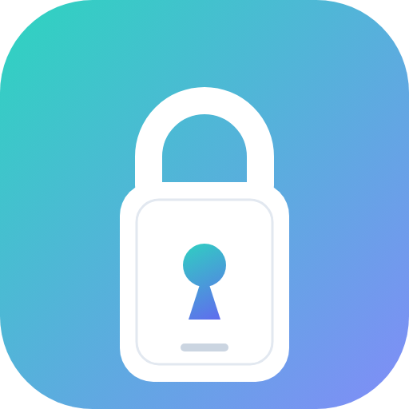
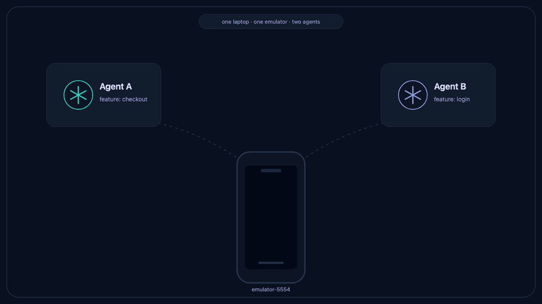

<div align="center">



# mic-lock

<a href="https://www.npmjs.com/package/mic-lock"></a>
<a href="https://www.npmjs.com/package/mic-lock"></a>
<a href="LICENSE"></a>

### Many agents. One emulator. No collisions.

A **local, serverless device lock** for parallel AI coding agents — so the several
Claude sessions on your laptop stop clobbering each other's emulator. Install once,
and forget it's there.

<p><code>npm install -g mic-lock</code></p>

<sub><a href="#problem">The problem</a> · <a href="#install">Install &amp; forget</a> · <a href="#docs">Technical docs ↓</a></sub>

</div>

<a id="problem"></a>

## The problem

Claude can now build, install, and drive your app on real emulators and devices —
so you don't run one agent at a time anymore. You run **several in parallel**, each
in its own git worktree, all on one machine.

But a laptop only runs a couple of emulators. So two agents reach for the same one:
Agent A installs its build and starts testing — then Agent B installs **its** build
on top, mid-test. Agent A's changes vanish, it starts debugging a regression that
doesn't exist, and it sees taps it never made. Both runs are corrupted. Neither
agent did anything wrong — **they just can't see each other.**

<div align="center">

</div>

<a id="install"></a>

## Install and forget

mic-lock makes each device a **fair, first-come lock** an agent must hold before it
installs or tests. You run **one command, once** — after that, your agents
coordinate themselves. No server, no daemon, no Redis; just a CLI and a shared
folder in your home directory.

```bash
npm install -g mic-lock
mic-lock setup            # wires it into your Claude Code agents
```

Restart your agent sessions, and you're done. From then on:

- 🚦 **Fair queue, no starvation.** Busy? The next agent waits in a first-come line instead of clobbering — and is served the instant the device frees.
- ⚡ **Instant handoff.** A freed device is picked up right away (notify-on-free), so agents never idle-poll or trample a running test.
- 🛡️ **Crash-safe.** If an agent dies mid-test, its lease expires and the next agent reclaims the device — no wedged, stuck-locked emulators.
- 🙋 **Hold for a human.** An agent can park a build on a device *until you test it and approve* — a built-in QA gate between agents.
- 📦 **Zero infrastructure.** Pure atomic filesystem operations. Works offline, nothing to deploy or babysit.

Enforcement is **deterministic**, not a polite request: a `PreToolUse` hook blocks
any un-coordinated device command and tells the agent how to fix itself, so
coordination doesn't depend on the model remembering. *(This combination — local +
serverless + fair FIFO + notify + hold-for-approval — [didn't exist before](COMPETITORS.md).)*

<a id="docs"></a>

---

## 📖 Keep reading: the technical details

Everything above is all most setups need. Below is the full reference — using it by
hand, every command, exit codes, and how the lock stays correct without a server.

---

## Using it directly

You rarely need to — the agents do this for you — but mic-lock is a normal CLI you
can drive yourself. First, find a device id every agent will agree on (use the
`adb` serial / simulator UDID so everyone converges on the same lock):

```bash
mic-lock discover
```

The resource name (e.g. `emulator-5554`) is just a stable string; unknown names are
auto-created as a simple 1-slot mutex on first use.

### The three ways to hold a device

**1. Hold it for a task of several commands (the usual case):**

```bash
mic-lock acquire emulator-5554 --owner "checkout-flow test" --wait
adb -s emulator-5554 install -r app.apk
# ... launch, poke, run tests — as many commands as you like ...
mic-lock release emulator-5554
```

A manual `acquire` is **sticky** — held until you explicitly `release` it, so it
survives across separate commands, which is exactly what a multi-step device task
needs. When `setup`'s enforcement hook is installed, **holding the lock also lets
your `adb`/`gradlew`/`xcodebuild` commands through** until you release. Nothing
renews a sticky hold, so a crash won't free it automatically — release promptly, and
recover an abandoned hold with `mic-lock status` + `mic-lock release <device> --force`.

**2. Wrap a single command (crash-safe, auto-releases):**

```bash
mic-lock with emulator-5554 --owner "smoke test" -- \
  bash -c 'adb -s "$MIC_LOCK_DEVICE_ID" install -r app.apk && ./gradlew connectedCheck'
```

Acquires (waiting in line if busy), heartbeats the lease while your command runs, and
releases on exit — even on crash or Ctrl-C. The locked device id is in
`$MIC_LOCK_DEVICE_ID`. Best for one self-contained step; use #1 when you'll issue
separate commands. **Automated runs should use `with`.**

**3. Hold until a human approves:**

```bash
mic-lock acquire emulator-5554 --until-approved   # deploy your build, then tell the human:
#   "Ready on emulator-5554 — test it, then run:  mic-lock approve emulator-5554"
```

An `--until-approved` lock never auto-releases and survives your process exiting (and
even a reboot). Only `mic-lock approve emulator-5554` (or `release --force`) frees it
— so a human can manually verify the device before the next agent takes it.

### Pools and semaphores

If a machine can run *N* interchangeable emulators, register a **pool** and let agents
grab any free one:

```bash
mic-lock config register emulators --kind pool --device-ids emulator-5554 emulator-5556
mic-lock acquire emulators            # grants a specific free device; its id is in the result
```

Or a plain N-slot **semaphore** when the slots are anonymous:

```bash
mic-lock acquire ci-slot --capacity 2 --wait
```

## Setup & enforcement (deep dive)

`mic-lock setup` installs three things (idempotently):

1. **The Claude Code skill** — teaches agents to take a device once and hold it for
   the whole task (`acquire` → work → `release`), wrap one-off commands in `mic-lock
   with …`, label the hold with `--owner`, honor exit codes, and use `--until-approved`
   + `approve` when you want to test by hand.
2. **A PreToolUse hook (`mic-lock guard`)** — *enforcement*. It **blocks** any Bash
   command that touches a shared device (`adb install/shell/push`, `emulator` boot,
   `xcrun simctl`, `gradlew connected*`, `xcodebuild test`, `flutter`/`react-native`/`expo
   run`) **unless the agent's worktree already holds a device lock** or it's wrapped in
   `mic-lock`, and tells the agent how to fix it. Read-only checks (`adb devices`,
   `simctl list`) are allowed. This does not depend on the model choosing to comply.
3. **A `CLAUDE.md` rule** fixing the naming convention (lock by adb serial / simulator
   UDID) so every agent converges on the same lock name.

```bash
mic-lock setup                # this machine, all projects  (writes ~/.claude/)
mic-lock setup --project      # this repo (committable, travels to teammates)
mic-lock setup --print        # dry run — show what it would change
```

Scope — pick deliberately. **`--user`** (`~/.claude/`) is the CLI default, but it
enforces the guard on **every project on this machine**, including repos that never ran
mic-lock setup: their unwrapped device commands are blocked until wrapped in `mic-lock`.
Prefer **`--project`** (recommended): it writes the repo's `.claude/` so enforcement
stays scoped to just that repo, and committing it gives teammates and other machines the
same enforcement (each machine still needs mic-lock installed). Hooks load at session
start, so restart agent sessions after running it.

> `MIC_LOCK_ENFORCE=scoped` downgrades a would-be block to *allow* unless the project
> opted in via `setup --project` — letting the guard be installed machine-wide but only
> enforce in participating repos.

**Turning it back off** — `mic-lock uninstall` reverses `setup`: it removes the skill,
the `PreToolUse` hook and the `CLAUDE.md` rule, and purges the lock state at `~/.mic-lock`.
It mirrors `setup`'s scope flags, preserves any unrelated settings/hooks, and is idempotent.

```bash
mic-lock uninstall              # remove from ~/.claude/ + purge locks
mic-lock uninstall --project    # remove this repo's .claude/
mic-lock uninstall --print      # dry run — show what it would remove
mic-lock uninstall --keep-locks # leave ~/.mic-lock intact
```

The purge is skipped (with a warning) if another agent is currently holding or waiting on
a lock — pass `--force` to override. Re-enable anytime with `mic-lock setup`.

> `uninstall` only undoes `setup` — the `mic-lock` CLI itself stays on your PATH. To
> remove it too, run `npm rm -g mic-lock` (or `npm unlink` if you installed from source).

See [skills/mic-lock/SKILL.md](skills/mic-lock/SKILL.md). All commands support `--json`
for parsing.

<details>
<summary><strong>Install from source</strong> (for development, or to hack on mic-lock)</summary>

```bash
git clone https://github.com/Michael23Magdy/mic-lock.git && cd mic-lock
npm install
npm run build
npm link          # puts `mic-lock` (and `mlk`) on your PATH
```

Requires Node ≥ 18. Android discovery uses `adb`; iOS discovery uses `xcrun simctl` —
both optional, the lock core needs neither.

</details>

## Command reference

| Command | What it does |
|---|---|
| `setup [--user\|--project [dir]] [--print]` | Install & forget: skill + enforcement hook + naming rule |
| `uninstall [--user\|--project [dir]] [--print] [--keep-locks] [--force]` | Reverse `setup`: remove skill + hook + rule, purge lock state (aliases: `disable`, `remove`, `teardown`) |
| `guard` | PreToolUse hook (used by `setup`); blocks unwrapped device commands |
| `acquire <res> [--wait] [--timeout <ms>] [--until-approved] [--ttl <s>]` | Take a lock; joins the FIFO queue when busy |
| `release <res> [--token <fence>] [--force] [--reason <t>]` | Release yours, or force-release (steal) someone's |
| `approve <res> [--slot <id>]` | Human releases an `until-approved` hold for the next agent |
| `with <res> -- <cmd…>` | Acquire, run `cmd` with heartbeat, auto-release on exit |
| `status [res] [--watch]` | Holders, wait queues, pending approvals (live with `--watch`) |
| `watch [res] [--events <t,…>]` | Stream lock events as they happen |
| `queue <res>` | The FIFO wait line for one device |
| `discover [--adb] [--simctl]` | List real Android/iOS devices + their lock state |
| `list [--devices]` | List registered resources (and optionally devices) |
| `verify <res> --token <fence>` | Assert your fence still owns the lock (exit 12 if not) |
| `gc [res]` | Reclaim stale locks, prune dead waiters, sweep tombstones |
| `config register\|list\|set-defaults` | Register resources / view / set default tunables |

Global flags (after the subcommand): `--json`, `--state-dir <path>`, `--no-notify`,
`-q/--quiet`, `--verbose`. `--owner <label>` on `acquire`/`with`. The CLI is also
available as the shorter alias `mlk`.

### Exit codes (for scripting/agents)

| code | meaning |
|---|---|
| `0` | success |
| `2` | usage error |
| `10` | busy (no `--wait` given) |
| `11` | timed out waiting |
| `12` | superseded — you lost the lock (stale-broken or force-stolen) |
| `13` | held for human approval |
| `20` | could not take the coordination gate (contention/corruption) |
| `1` | other error |

## How it works

mic-lock is a **two-layer lock** over a shared state directory, using classic
algorithms so it's correct without a server.

**Layer 1 — the gate.** A per-resource mutex held for *microseconds*, built on an atomic
create-only primitive (`mkdir`, atomic on APFS). Every state change runs inside it, so
ticket draws, grants and stale-breaks are serialized and race-free. A gate held longer
than a few seconds means a crashed process, so it is safely broken.

**Layer 2 — the lease.** The holder record carries a monotonic **fence token**, a lease
**TTL**, and a **heartbeat**. This governs who may actually use the device and how crashes
are recovered.

The pieces, and the well-known algorithms behind them:

- **Fairness — Lamport's Bakery algorithm.** Each waiter draws a monotonic ticket; the
  lowest-numbered *live* waiter is served next. A crashed waiter ahead of you is skipped,
  so no one starves. (A gate-free fast path lets only the apparent head-of-line take the
  gate, so N waiters don't all serialize.)
- **Crash recovery — leases.** `with` (and `acquire --ttl`) take a lease that is
  heartbeated in-process; if that process crashes, the lease expires and the next waiter
  reclaims the device. A plain manual `acquire` is instead *sticky* (no lease) and is
  freed only by an explicit `release`/`--force`. PID liveness uses `kill -0` plus the
  process start time (defeats PID reuse) plus the boot session id (a leased holder from a
  previous boot is treated as dead).
- **Zombie protection — fencing tokens (Kleppmann).** Every grant gets a strictly higher
  fence token. A holder whose lock was stale-broken or stolen fails its next renew/release
  as *superseded* and won't clobber the new holder.
- **Notify-on-free.** Waiters wake via `fs.watch` (FSEvents) with a ~250 ms poll backstop
  for coalesced events, so a freed device is picked up near-instantly. Optional macOS
  desktop notifications + terminal bell announce your turn and approval requests.
- **Hold-for-approval.** An `until-approved` lock has no lease expiry and is never
  auto-reclaimed — it survives process death and reboot, and only a human `approve` (or
  `--force`) releases it.

**Safety is structural.** Capacity equals the number of slot files, and a lock is only
ever written into a free slot under the gate — so "≤ capacity holders, never a
double-acquire" does not depend on the bakery being bug-free. This is exactly what the
stress tests assert: 10 contending processes, zero double acquisitions, capacity always
respected, and a SIGKILLed holder reclaimed.

### State layout (`~/.mic-lock/`, override with `--state-dir`)

```
config.json                       # global default tunables
resources/<encoded-name>/
  meta.json                       # kind (mutex|pool|semaphore), capacity, device ids
  gate.lock/                      # Layer-1 coordination mutex (held ~µs)
  seq.json                        # monotonic ticket + fence counters
  holders/<slot>.json             # Layer-2 lease(s): owner, pid, fence, lease, mode
  queue/<ticket>-<owner>.json     # FIFO waiters
  dead/<fence>-<uuid>.json        # retired holders (audit)
  events.ndjson                   # append-only event log (feeds status/watch)
```

### Tuning

Defaults (ms): lease `ttl=12000`, `heartbeat=2000`, `grace=5000`. A healthy holder renews
~6× per lease, so it must miss several heartbeats before another agent reclaims it.
Override globally or per-resource:

```bash
mic-lock config set-defaults --ttl 20 --heartbeat 3 --grace 8      # seconds
mic-lock config register pixel7 --ttl 30                            # per resource
```

## Development

```bash
npm run build         # compile TypeScript to dist/
npm test              # fast, deterministic unit tests (fake clock + fake liveness)
npm run test:stress   # multi-process contention + crash-recovery tests
npm run typecheck
```

### Use as a library

The engine is also usable programmatically (ships with TypeScript types), with an
injectable clock and liveness for testing:

```bash
npm install mic-lock
```

```ts
import { LockEngine } from "mic-lock";
```

## License

MIT © Michael23Magedy
